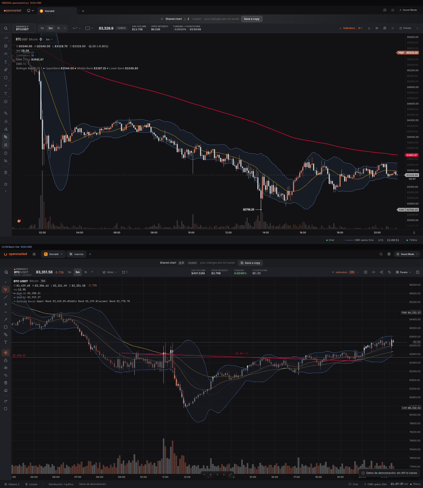

# OpenMarket Chart — reconstrucción en React + Vite

Terminal de gráficos **reconstruido desde cero** a partir del análisis del original
`https://openmarket.xyz/chart/r8e6KKi7`: misma estructura, medidas, colores y
comportamiento, con **código propio** (no se ha copiado código propietario) y
**datos ficticios generados en local** (sin API keys, sin conectar cuentas).



---

## Cómo ejecutarlo

```bash
npm install
npm run dev        # http://localhost:5173
npm run build      # bundle de producción (dist/)
npm run preview    # sirve el bundle
```

Sin variables de entorno, sin claves y sin backend: el catálogo de instrumentos,
las velas OHLCV, los indicadores y el flujo de mercado se generan en el navegador.

---

## Qué se ha reproducido (medido sobre el DOM del original)

| Franja | Original (medido) | Clon |
|---|---|---|
| Cabecera global | `0,0 1920×40`, `#121215` | idéntico |
| Franja «Shared chart» | `0,40 1920×40` → 36 px en móvil | idéntico |
| Barra del gráfico | `0,80 1920×44`, `#202126` | idéntico |
| Rail de herramientas | `x0 w52` desde `y124` | idéntico (40/32/30 px en móvil) |
| Área del gráfico | `52,124 1868×920` a 1920×1080 | idéntico |
| Pie | `0,1044 1920×36`, `#191a1e` | idéntico (36 px también en móvil) |
| Hoja «Best on Desktop» | `#0f0d0c`, radio 14 px arriba, ≤768 px | idéntico |

Comprobado por script en los **7 tamaños** (`1920×1080, 1440×900, 1366×768,
1024×768, 768×1024, 430×932, 375×812`): **0 errores de consola** y **sin scroll
horizontal** en todos. Capturas en `docs/` y comparativas apiladas
(original arriba, clon abajo) en `docs/comparativas/`:

| Tamaño | Comparativa |
|---|---|
| 1920×1080 | `docs/comparativas/comparativa-1920x1080.png` |
| 1440×900 | `docs/comparativas/comparativa-1440x900.png` |
| 1366×768 | `docs/comparativas/comparativa-1366x768.png` |
| 1024×768 | `docs/comparativas/comparativa-1024x768.png` |
| 768×1024 | `docs/comparativas/comparativa-768x1024.png` |
| 430×932 | `docs/comparativas/comparativa-430x932.png` |
| 375×812 | `docs/comparativas/comparativa-375x812.png` |

---

## Gráfico (real, no una imagen)

- Motor **Lightweight Charts 4** (MIT), equivalente al motor propio «Titan Charts»
  del original; el aspecto (velas, grid tenue, crosshair, píldoras) se ha replicado
  con la paleta medida: alcista `#c8ccd1`, bajista `#d27a61`, fondo `#121214`.
- Velas / barras / línea / área, **volumen** en histograma, escalas y ejes propios.
- **Indicadores calculados a mano** (sin librerías): EMA 20, EMA 50, Bandas de
  Bollinger (20, 2) con relleno, VWAP y, en panel inferior sincronizado, RSI 14 y
  MACD (12, 26, 9).
- Zoom, desplazamiento, encuadre y **crosshair conectado a la leyenda OHLC**.
- Píldoras **High/Low del rango visible** pegadas al eje derecho, **precio actual +
  cuenta atrás** de cierre de vela y los **dos objetos heredados bloqueados** que
  anuncian la franja «Shared chart · 🔒 2 · locked».
- Herramientas de dibujo propias: tendencia, rayo, horizontal, vertical, zona,
  medición y texto, con capa SVG encima del lienzo y selección por proximidad.

## Funcionalidad

- **Cambiar de símbolo** (paleta ⌘K / Ctrl+K y watchlist), **timeframe** (1m…1D),
  tipo de gráfico, distribución (1 / 2 vertical / 2 horizontal).
- **Paneles laterales** conmutables: Watchlist, Order book (simulado), Time & sales,
  Chart chat, Objects (gestor de dibujos: ocultar, renombrar, borrar).
- Menús desplegables (indicadores con interruptores, paneles, tipo de gráfico,
  layout, intervalos), toasts, hoja móvil, atajos (⌘K, Esc, V/T/R/H/J/B/M/X, Supr).
- Todo el estado vive en `TerminalContext` (React Context, sin librerías de estado).

## Estructura

```
src/
  components/layout/   GlobalNav, TierBanner, ChartShell, ToolRail, Footer
  components/toolbar/  ChartToolbar, IntervalRuler, IndicatorsMenu, PanelsMenu
  components/chart/    ChartArea, PriceChart, ChartLegend, ChartPills, IndicatorPane
  components/panels/   SidePanel, Watchlist, OrderBook, Trades, ChatPanel, ObjectsPanel
  components/ui/       Dropdown, Palette (⌘K), MobileSheet, Toasts
  hooks/               useClock, useOutsideClick, useMediaQuery
  data/                symbols, marketData (OHLCV sintético), indicators, microstructure
  state/               TerminalContext
  styles/              tokens, base, layout, chart, menus, panels, responsive
tools/                 probe.js, sizes.js, shots.js (verificación con navegador real)
docs/                  capturas del clon + comparativas con el original
```

---

## Lo que NO se puede inspeccionar (y cómo se ha resuelto)

El original carga en **Guest Mode** y responde **401** en los ajustes del terminal y
todo lo que depende de la cuenta. Por tanto **no se ha podido observar ni medir**:
cuenta y portfolio, órdenes reales, ajustes guardados, WebSocket privado, paneles de
usuario, editor de scripts y chat con sesión.

Estrategia (regla 11): esas zonas se implementan como **mock funcional local**, con
los mismos componentes y estados, datos simulados y un aviso en pantalla —
**no se ha inventado ningún flujo privado**. En el código están marcadas con un
comentario que lo indica.

## Diferencias conocidas con el original

- El catálogo del clon es una lista local de **8 símbolos** (el original carga
  ~1183 pares de Binance); cambiarlo es una línea en `src/data/symbols.js`.
- En móvil (≤600 px) el clon **mantiene el rail de herramientas** (32/30 px) para no
  perder los dibujos; el original lo oculta.
- Los textos que en el original dependen del servidor (órdenes, chat de la sala,
  editor) muestran un aviso de «demo local» en vez de datos reales.
- La tipografía usa las familias del original (Inter, JetBrains Mono) vía Google
  Fonts; sin red se degrada a las fuentes del sistema.

## Verificación (navegador real)

```bash
npm run verify                                  # 7 tamaños + recorrido funcional
node tools/probe.js 1920 1080 /tmp/shot.png      # medidas + errores de consola
node tools/sizes.js                              # los 7 tamaños de una pasada
node tools/interact.js                           # paleta, símbolos, menús, paneles, dibujo
node tools/shots.js                              # capturas en docs/
```

Estado actual de la verificación:

- **7 tamaños** (`1920×1080 → 375×812`): franjas idénticas al original, **0 errores
  de consola** y `scrollX = false` en todos.
- **Recorrido funcional** (`tools/interact.js`): paleta ⌘K y filtrado, cambio de
  símbolo (BTC→ETH) y de intervalo (5m→1h), menú de paneles (Watchlist + Objects),
  activación del MACD en panel inferior sincronizado, creación de un dibujo y
  borrado con Supr, arrastre y zoom: **10/10 con 0 errores**.
- Captura del estado tras el recorrido: `docs/clon-interaccion.png`.

Requisitos de los scripts: `puppeteer` (en `/home/user/.cache/pptr` o el tuyo) y el
servidor de desarrollo en `127.0.0.1:5173`.
